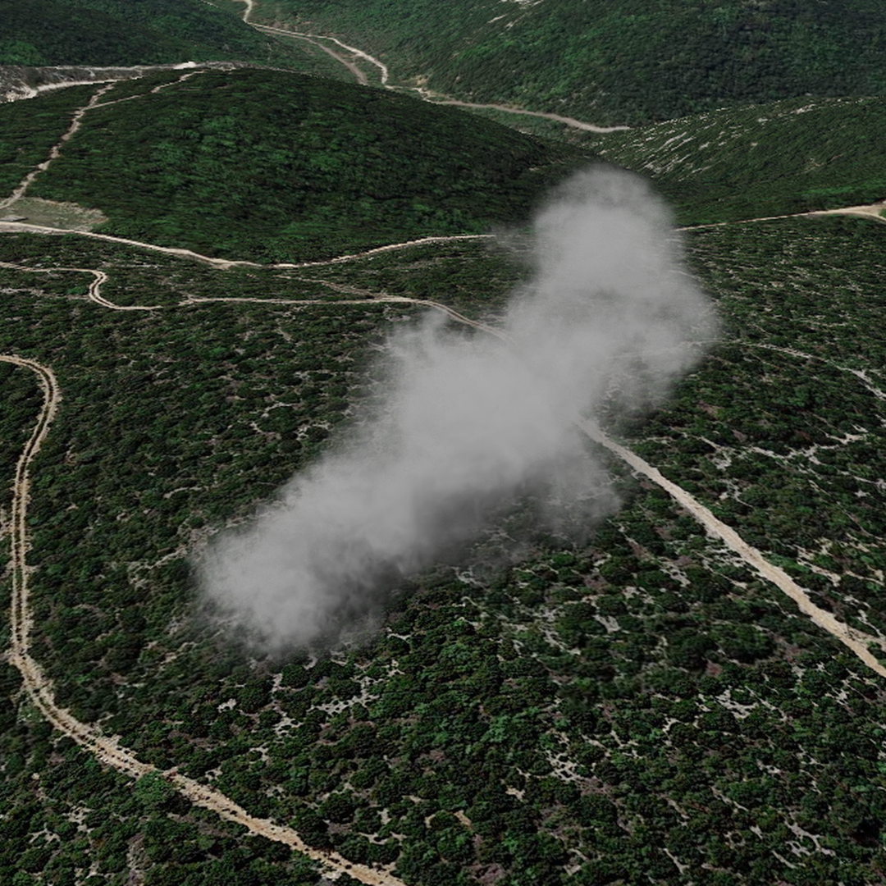

# albatros Smoke Generation Project

# Smoke generator V1
The Smoke Generator Project is a versatile tool for generating visually appealing composite images of smoke plumes against a variety of backgrounds. It combines Blender for smoke simulation and Python for image composition to create dynamic and captivating smoke images.

<p align="center">
  
</p>

## Table of Contents

- [Project Overview](#project-overview)
- [Project Structure](#project-structure)
- [Getting Started](#getting-started)
  - [Requirements](#requirements)
  - [Installation](#installation)
- [Usage](#usage)
- [Configuration](#configuration)
- [Acknowledgments](#acknowledgments)
- [License](#license)

## Project Overview

The Smoke Generator Project provides a simple yet effective solution for creating realistic smoke plume composite images. The project leverages Blender for smoke simulation and image composition and aims to offer flexibility in generating smoke images with varying properties, such as rotation and brightness adjustments.

## Project Structure

## Project Structure

- 📝 README.md: Detailed project documentation and information.

- **smoke_generator_env**: python env for library management
- 🔧 create_python_env.sh
- 📄 python_dependencies.txt

- **smoke_dataset_V1**: The main folder for version 1 of the smoke dataset
- **smoke_generator_V1**: The main folder for version 1 of the smoke generation code
  - **background_images**: Contains background images for smoke composition
  - **blender_files**: Holds Blender-related files and scripts for smoke simulation
    - 🐍 blender_main.py: Orchestrates smoke simulation generation within Blender
    - 🐍 blender_scene_utils.py: Contains utility methods for managing scene operations
    - 💻 random_smoke_plume.blend: Template/base Blender file for smoke simulations
  - **blender_images**: Contains numbered folders for different smoke plume simulations
    - 📁 smokeplume_(0...20)
  - **scripts**: Contains various scripts related to the project
    - 🐍 application_interface.py: Manages user interaction and UI
    - 🐍 display_project_architecture.py: Visualizes the project structure
    - 🐍 image_composer.py: Composes or processes smoke-related images
    - 🐍 image_harmonization.py: Harmonizes image qualities
    - 🐍 install_harmonization.py: Manages image harmonization process
    - 🐍 bb_eda.py: EDA for rescaling size
    - 🐍 mask_eda.py: EDA for smoke mask quality
    - 🐍 sky_eda.py: EDA for non sky regions
    - 🐍 motion_blur_eda.py: motion blur transforms
    - 🐍 main.py: Main entry point script for running the project
- **(Future project deployment):**
  - 📁 smoke_dataset_V2: Placeholder for version 2 of the smoke dataset
  - 📁 smoke_generator_V2: Placeholder for version 2 of the smoke generation code


## Getting Started

### Requirements

- [Blender](https://www.blender.org/) (version 3.41 or later)
- [Python](https://www.python.org/) (version 3.10 or later)
- Python libraries:
  - Pillow==8.3.1
  - matplotlib==3.4.3
  - torch==1.9.1
  - torchvision==0.10.1
  - gdown==4.7.1
  - cv2
  - tk
  - scikit image
  - pandas 
  - numpy 
### Installation

1. Clone the repository to your local machine:

```bash
git clone https://github.com/mmeignin/albatros.git
cd albatros
sh create_python_env.sh
#activate python env
python3 install_harmonization.py
python3 main.py
```

### Usage

1. Open Blender and run the `blender_main.py` script in the `blender_file` folder to generate smoke plume images in the `blender_images` folder.

2. Run the `main.py` to perform composition between smoke images and background images

3. Experiment with the configuration options in the `main.py` script to customize the appearance of the composite images.

## Configuration


## Acknowledgments

The Smoke Generator Project is inspired by [cite the source if applicable].


Please replace `[License Name]`, update the sections with actual links, versions, and relevant information specific to your project, and add any additional sections as needed.
